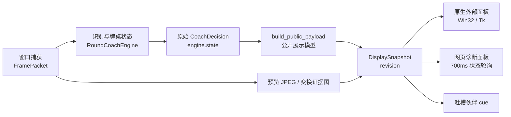

# 雀魂插件冗余逻辑审查路线

## 路线定义

本工作树的首要目标不是重写雀魂插件，而是严格审查现行实现中的冗余逻辑，并在有证据时做无行为变化的精简。

审查必须回答四个问题：

1. 同一输入是否被重复捕获、识别、转换、排序或渲染？
2. 同一状态是否存在多个所有者，因而可能互相覆盖或不同步？
3. 某个分支是否真实可达，是否仍有入口、调用者和测试？
4. 某段相似逻辑是实际重复，还是承担兼容、降级或不同运行环境职责？

## 硬性边界

- 第一阶段只审查、量化和记录，不删除代码。
- 不调整向听、有效牌、役种、风险预算或攻守权重。
- 不以文件大、函数长作为删除依据；必须给出调用链和运行条件。
- 不把 Win32、Tk、网页诊断、CPU、CUDA、DirectML、Legacy、YOLO26 等不同环境路径直接视为重复。
- 每个精简项必须说明行为不变量、回归测试、性能或内存验证方式和回滚边界。
- 无法证明等价的逻辑不得合并。

## 审查基线

- 重构工作树：`mahjong-refactor-20260812`
- 分支：`codex/mahjong-refactor-20260812`
- 基线：`origin/main@e8c16124`
- 重要事实：该 `main` 基线不包含 `plugin/plugins/mahjong_coach`。
- 现行功能样本：只读审查 `mahjong-memory-slim-20260804` 工作树中的 `展示用` 分支及其未提交改动。
- 在形成可复现的功能快照前，不把现行工作树整体复制到本路线，也不修改原工作树。

## 第一轮规模证据

现行插件核心差异约为 76 个文件、37,857 行新增代码，不含 vendor 运行库的内部源码量统计如下：

| 文件 | 行数 | 函数数 | 当前可疑点，不代表删除结论 |
| --- | ---: | ---: | --- |
| `coach.py` | 6,233 | 199 | 识别状态机、牌河跟踪、策略排序和牌效算法集中在同一模块 |
| `overlay.py` | 3,913 | 118 | Win32 与 Tk 两套窗口后端各自包含大量布局、交互和渲染代码 |
| `__init__.py` | 3,873 | 123 | 单个插件类约 3,213 行，同时管理生命周期、实战循环、快照、悬浮窗和搭话投递 |
| `presentation.py` | 1,362 | 31 | 对外展示转换与悬浮窗二次格式化可能存在职责交叠 |
| `capture.py` | 504 | 23 | 捕获入口、降级方案和持久化路径需要核对是否重复执行 |
| `models.py` | 461 | 25 | 多个状态对象与字典快照并存，需要核对所有权与复制次数 |

最大函数包括：

- `overlay.py::_run`：约 1,429 行。
- `overlay.py::_run_win32`：约 879 行。
- `coach.py::rank_discard_decisions`：约 368 行。
- `__init__.py::_push_neko_companion_if_needed`：约 262 行。
- `__init__.py::_overlay_start_live`：约 193 行。
- `coach.py::analyze_frame`：约 187 行。

## 初步审查热点

### A. 双原生 UI 后端

需要逐项比较 Win32 与 Tk 的：

- 配置页状态；
- 点击区域；
- 简洁视图；
- 完整策略卡；
- 更新队列；
- 关闭流程；
- 偏好持久化。

目标不是删除某个后端，而是识别能否共享同一个 view model、布局描述和动作路由。

### B. 插件生命周期巨型类

`MahjongCoachPlugin` 同时持有：

- 捕获会话；
- 实战任务；
- 引擎状态；
- 原始决策；
- 对外展示快照；
- 悬浮窗状态；
- 搭话去重与投递状态；
- 模型预热与运行资源信息。

需要建立唯一状态所有者表，定位相同事实是否在 `_last_decision`、`_display_snapshot`、engine state、live state 和 overlay payload 中多次保存。

### C. 状态转换分散

静态统计发现 `round_phase` 和 `last_update_reason` 各有约 10 个赋值点。它们可能是合法状态机，也可能存在绕过统一转移函数的写入。必须逐一列出前置条件和后继状态后再判断。

### D. 展示转换链

需要确认下面的链条是否存在重复清洗、重复复制或不同步：

`CoachDecision -> public payload -> display snapshot -> overlay payload -> strategy card/text -> Win32/Tk render`

特别检查同一候选牌、风险说明和牌型理由是否在 `presentation.py` 与 `overlay.py` 分别重新推导。

### E. 兼容包装函数

`__init__.py` 与 `perception/__init__.py` 存在若干同名转发函数，例如模型预热、缓存释放和诊断图生成。这类代码只有在确认没有 monkeypatch、测试隔离、延迟导入或兼容 API 需求后，才可标记为冗余。

## 冗余分类标准

| 分类 | 证明要求 | 优先级 |
| --- | --- | --- |
| 重复执行 | 同一帧、同一输入在一轮中执行等价计算两次以上 | 高 |
| 重复状态 | 同一事实存在多个可写所有者，并出现同步代码 | 高 |
| 重复转换 | 同一结构在多层反复转字典、清洗、重新生成文本 | 高 |
| 不可达分支 | 无入口、无调用者、无配置可达路径，并通过覆盖验证 | 中 |
| 过度兜底 | 正常结果被兜底覆盖，或多个兜底互相叠加 | 高 |
| 合法适配 | 不同平台、识别后端或分发模式承担不同职责 | 不删除 |

## 审查交付物

每个候选项记录：

- 编号和位置；
- 完整调用链；
- 触发条件；
- 状态读写集合；
- 与相似逻辑的差异；
- 是否可合并、可删除或仅需封装；
- 行为不变量；
- 测试与基准；
- 风险等级；
- 最终处理状态。

只有完成上述记录的候选，才进入代码精简阶段。

## 第一轮审查结论

以下行号均指向只读样本工作树 `mahjong-memory-slim-20260804` 中的
`plugin/plugins/mahjong_coach`。本轮没有改动该样本，也没有删除任何业务代码。

### 总体数据流

设计意图是“一次识别、一次发布、多端消费”，但现行实现实际存在：

- 普通静态帧仍反复生成诊断图和预览图；
- 同一逻辑帧因图片落盘而完整发布两次；
- 网页状态查询独立重建展示模型，并可能返回未正式发布的临时快照；
- 多个界面保存相同状态的不同副本；
- 搭话投递的诊断确认同步阻塞识别循环。

### 状态所有权现状

| 事实 | 当前副本或写入点 | 审查判断 |
| --- | --- | --- |
| 当前牌桌状态 | `engine.state`、`CoachDecision.coach_state`、`_last_decision`、`display_snapshot.round_state`、overlay payload | 副本过多；应保留原始引擎状态和一个不可变 PublishedView |
| 当前展示内容 | `_display_snapshot`、status 临时 snapshot、overlay controller 本地 payload、Win32/Tk 控件状态 | 存在临时快照未发布导致的分叉 |
| 实战会话状态 | capture producer、analysis consumer、run-loop `finally`、`_stop_live_task` 均写 `_live_state` | 多写者；需要统一状态迁移入口 |
| 玩家画像 | `_preferences.profile`、`_cfg.player_profile`、`engine.config.player_profile`，另有派生 `play_style` | 手动同步，存在漂移风险 |
| 搭话投递状态 | 多条成功/失败分支分别写 stage、id、signature、时间、计数 | 重复状态迁移且失败分支不完全对称 |
| 图片证据 | 固定路径、`last_frame_revision`、display snapshot image 字段 | 路径固定是合理设计，但图片修订不应推动策略修订 |

## 已确认问题清单

### R-001：普通静态帧绕过预览节流

- 等级：P0。
- 分类：重复执行、无效磁盘和诊断工作。
- 证据：`CoachDecision.quiet` 默认是 `False`（`models.py:303-317`）；普通 `_observe_decision()` 没有把它设为 `True`（`coach.py:930-960`）。`_should_persist_preview()` 只要看到 `not decision.quiet` 就立即允许持久化（`__init__.py:2042-2056`）。
- 实际链路：普通无变化观察帧 → `last-preview.jpg` 写盘 → 诊断快照生成 → 第二次 `_update_overlay()`。
- 影响：原设计的 0.8 秒/4 秒预览节流对常见观察帧基本失效；约每个捕获周期都可能发生 JPEG 写入、诊断图渲染和额外界面修订。
- 处理方向：把“策略内容是否安静”和“是否刷新诊断预览”拆成两个事实。普通观察按 cadence；立直、鸣牌、和牌、结算等关键事件允许立即刷新。诊断图进入最新值后台槽，不阻塞文字发布。
- 行为不变量：关键事件文字仍立即出现；最近一张证据图最终一致；网页诊断仍可取得最新完整证据。

### R-002：status 会生成未正式发布的临时展示快照

- 等级：P0。
- 分类：重复状态、前后端分叉。
- 证据：`mahjong_coach_status()` 发现 mode 或 round 不匹配时调用 `_make_display_snapshot()`（`__init__.py:602-614`），但不写回 `_display_snapshot`，不递增 `_display_revision`，也不推送到原生 overlay。
- 影响：网页本次响应可能拿到新内容，原生外部面板和缓存仍停在旧内容；这能直接解释部分“后端已经变了，外部面板没有跟上”。
- 处理方向：建立唯一的 `get_or_publish_view()`。任何 round/mode 失效都通过同一个原子发布事务更新缓存、revision 和所有消费者，读取接口不得私自产生另一份业务快照。
- 行为不变量：同一 revision 下网页、Win32、Tk 的 `round_state`、候选卡和模式必须逐字段一致。

### R-003：网页 700ms 轮询允许旧响应覆盖新响应

- 等级：P0。
- 分类：并发重复请求、乱序覆盖。
- 证据：`static/main.js:1531-1546` 用 `setInterval` 无条件发起 `refreshStatus()`，没有 in-flight 锁；`renderDashboard()` 不比较请求序号或 `display_snapshot.revision`。
- 影响：一次较慢的旧请求可以在新请求后返回，并把新局面覆盖回旧局面，表现为闪回、延迟或缓存似乎未清理。
- 处理方向：先改成单飞轮询——一次结束后再安排下一次；同时用请求序号和 snapshot revision 双重拒绝旧响应。长期可以换成轻量最新状态接口或推送。
- 行为不变量：旧 revision 永远不能覆盖新 revision；停止捕获后不遗留轮询请求。

### R-004：搭话通道诊断同步阻塞实战热路径

- 等级：P0。
- 分类：不必要的同步等待。
- 证据：每次 cue 先等待 message-plane probe（`__init__.py:3014`，底层查询见 `2769-2781`）；SDK submit 后又等待 ingest 确认（`3126-3141`，轮询见 `2791-2815`）。单次查询预算可达 250ms，SDK await 另有 0.75s 上限。
- 影响：搭话诊断与确认发生在 live consumer 内，关键事件之后的预览、结算证据和下一帧处理都可能被拖住。
- 处理方向：热路径只负责提交并记录 delivery id；probe、ingest 和 host receipt 改为可取消后台任务。诊断失败只更新运行状态，不反向阻塞策略和外部面板。
- 行为不变量：一次 cue 只提交一次；只有真实 submit 成功才消费去重签名和 cadence；旧回执不得覆盖新 delivery。

### R-005：一帧为更新图片而完整发布两次策略

- 等级：P1。
- 分类：重复转换、重复渲染。
- 证据：live loop 先在 `__init__.py:1886` 调用 `_update_overlay(payload)`；写完 JPEG、更新 image revision 后又在 `1913` 对同一 payload 调一次。两次都会执行 `build_public_payload`、compact 文本、结构化卡、长文本卡和详情文本。
- 影响：一个逻辑帧产生两个 display revision，并向原生 UI 发送两次整套卡片。微基准显示纯格式转换约 0.1ms，不是数秒延迟主因；真正浪费是完整重传、revision 抖动和全量重绘。
- 处理方向：策略使用 `content_revision`，图片使用 `evidence_revision`。JPEG 完成只 patch `image_path/image_revision`。
- 行为不变量：仍然先显示文字，再显示匹配证据图；图片变化不得改变策略 revision 或搭话 signature。

### R-006：原生界面没有按内容差异局部重绘

- 等级：P1。
- 分类：重复渲染。
- 证据：每个识别结果都会调用 `_update_overlay()`；Tk 每次重建完整策略卡和布局，Win32 每次 `InvalidateRect`。仅 companion 状态或图片 revision 改变也会推动全卡刷新。
- 处理方向：共享 ViewModel 增加 `content_revision`、`evidence_revision`、`runtime_revision`；renderer 只刷新对应区域。
- 行为不变量：Win32 与 Tk 显示同一标题、候选数量、开关值和 surface kind。

### R-007：捕获指纹已计算，但运行时调度没有使用

- 等级：P1。
- 分类：无效计算、同帧重复哈希。
- 证据：`capture.py:174-194` 已生成 32×18 BLAKE2 fingerprint；运行时没有消费者。之后 `perception/image_source.py:52-63` 的 `source_identity()` 又做 RGB、resize 和 hash，并被场景、YOLO、缓存和预览路径重复调用。
- 处理方向：引入一次构建的 `FrameContext`，共享 RGB、source identity、capture fingerprint 和 warp。跨帧跳过推理必须依赖经过验证的区域指纹，不能仅凭对象 id。
- 行为不变量：同一帧各检测器共享缓存；新帧或像素突变绝不复用旧 YOLO 结果。

### R-008：Legacy 新局确认帧完整识别同一图片两次

- 等级：P1。
- 分类：重复模型推理，但不能直接删除第二次调用。
- 证据：`_analyze_live_packet()` 先在 `__init__.py:2209-2216` 分析；gap 判定为 `new_round` 后 reset，再在 `2229-2239` 对同一 image source 调用完整 `analyze_frame()`。reset 会清场景、YOLO、指纹和策略缓存。
- 原因：第二次分析是为了避免新局决策携带上一局状态，因此有行为职责；直接删掉会出错。
- 处理方向：把“感知识别结果”与“回合状态解释”分离。提交帧只生成一次不可变 `PerceptionFrame`；reset 只清回合/策略状态，再用同一个感知结果重建新局 decision。
- 行为不变量：新回合不带旧牌河、副露或策略；提交帧模型、warp、OCR 各只执行一次。

### R-009：展示状态存在多层整棵复制与重复序列化

- 等级：P1。
- 分类：重复状态、重复转换。
- 证据：`engine.state` → `CoachDecision.coach_state` → `_last_decision` → `display_snapshot`；公开 payload 又同时含顶层 `round_state`、`last_decision.coach_state`、顶层和 decision 内的 `presentation`。status 还返回 `round_state`、`last_decision`、`display_snapshot`，最后用 `**public_state` 再展开一份。
- 处理方向：保留 raw engine transaction 与不可变 `PublishedView` 两个边界。各表面引用 PublishedView 的字段，不再各自重建整棵字典。
- 行为不变量：序列化后不允许 `coach_state` 与 `round_state` 内容漂移；对外隐私清洗保持不变。

### R-010：LiveSessionState 有多个并发写入者

- 等级：P1。
- 分类：状态所有权不清。
- 证据：start 创建状态；capture producer 写窗口绑定/等待；consumer 写 observing/error/frame；run-loop `finally` 和 `_stop_live_task` 都写 stopped。
- 处理方向：新增 `LiveSessionController` 或 reducer，producer/consumer 只上报事件；由单一入口执行合法迁移。
- 行为不变量：`start → window_lost → reconnect → stop` 可重复验证；stop 后旧 producer 不能重新把状态写成 running。

### R-011：搭话成功/失败状态迁移复制多次

- 等级：P1。
- 分类：重复业务逻辑。
- 证据：直接回复、message-plane 失效 fallback、SDK 拒绝后的 fallback、正常 SDK submit 四条成功路径，均重复写 submit ms、stage、delivery id、error、signature、时间、event kind、push count 和 cadence；异常分支又没有完整更新 failure stage/count。
- 处理方向：`CompanionDeliveryState` 配合 `_record_submit_success()`、`_record_submit_failure()`、`_record_receipt()`。新投递前取消旧 receipt watcher，stop 时清理任务。
- 行为不变量：一次成功 push count 只加一；异常和 submitted=false 的 UI 状态对称；旧 watcher 不能修改新 delivery。

### R-012：役满路线在普通画像下也每帧评估，役满画像会重复评估

- 等级：P1。
- 分类：重复计算。
- 证据：`_enrich_yakuman_decision()` 对所有 13/14 张手牌调用 service（`__init__.py:2269-2297`）；`yakuman.py:186-225` 在查后台缓存前先无条件计算即时路线。役满画像的 `build_round_plan()` 已算一次，enrich 再算一次。
- 量化：代表手牌首次约 26.9ms，热态约 12–15ms；不是主延迟，但属于稳定可回收开销。
- 处理方向：按 hand + visible + meld 缓存确定性 assessment；ready cache 优先；已有 routes 直接传给 service。若产品只在役满偏好展示，可不对普通画像 enrich。
- 行为不变量：相同 key 的路线、剩余张数和概率字段完全一致；后台估算仍不得阻塞操作建议。

### R-013：已经移除入口的详情按钮留下两套不可达窗口

- 等级：P1。
- 分类：已确认的生产不可达分支。
- 证据：Win32 `_show_detail()` 与 Tk `show_detail_panel()` 全仓只有定义，没有生产或测试调用；但两套详情窗口、图片加载、绘制和每帧 `overlay_detail` 仍保留。
- 处理方向：产品已明确移除旧 `?` 入口，因此可以在实现阶段删除两套详情窗口及 `overlay_detail` 数据链；网页诊断面板继续承担证据查看。若未来恢复，必须以新入口和新需求重新实现。
- 行为不变量：compact/full 主面板、网页证据图和关闭行为不受影响。

### R-014：overlay formatter 的 Legacy fallback 在生产链不可达

- 等级：P1。
- 分类：生产不可达兼容层。
- 证据：`_make_display_snapshot()` 必然先执行 `build_public_payload()`，它必然产生非空 `presentation`；因此 `overlay_text_from_payload`、`overlay_strategy_card_text_from_payload`、`overlay_strategy_card_from_payload` 的无 presentation fallback 在生产入口不会执行。旧式单测仍直接调用这些分支。
- 影响：其中结构化卡 fallback 再次推导风险、候选、牌型损失和 A/B/C 权衡，与 `presentation.py` 重复维护业务规则。
- 处理方向：生产 formatter 收紧为 `PublicPresentationV2`；若需要短期兼容，迁到独立 `legacy_overlay_adapter.py` 并输出弃用告警。
- 行为不变量：companion、strategy、call、win、settlement 的 golden snapshot 保持一致。

### R-015：完整长文本卡在正常渲染路径基本不可见

- 等级：P2。
- 分类：冗余 ViewModel。
- 证据：full 模式优先渲染非空结构化 `strategy_card`；compact 模式使用 compact text。正常生产每帧仍生成、保存和传递 `strategy_card_text`。
- 处理方向：结构化卡作为唯一 full 模型；compact 保留一个短文本。只有结构化卡生成失败时提供固定错误降级文本。

### R-016：Win32/Tk 业务状态处理重复，但两个 renderer 本身都合法

- 等级：P2。
- 分类：可共享业务层，不删除平台适配。
- 证据：冻结分发可能没有 `_tkinter`，必须保留 Win32；开发环境仍需要 Tk。两端当前分别解释配置、点击、卡片类型、颜色和布局语义。
- 处理方向：抽 `OverlayStateReducer + OverlayViewModel`；Win32/Tk 只保留平台控件、绘制和事件循环。
- 禁止动作：不能因为代码相似而删除任一 renderer。

### R-017：少量全仓无调用符号可进入删除候选

- 等级：P2。
- 分类：待确认外部契约的死代码。
- 高置信候选：`preferences.py:profile_from_entry_payload`、`player_profile.py:AmaeKoromoProvider.confirm`、`coach.py:_call_suggestion`、`coach.py:_risk_budget`、`coach.py:_claimed_tile_from_river_delta` 等仅定义包装函数。
- 处理方向：先查插件导出 API、文档和第三方 import 契约，再用覆盖率确认。没有契约才能删除。
- 特别说明：`companion_transport.py` 是旧宿主 message-plane 失效时的故障降级，不是冗余，禁止随上述候选删除。

### R-018：牌桌上下文“两帧确认”字段没有真实写入链

- 等级：P2。
- 分类：遗留状态和注释漂移。
- 证据：`table_context_pending_signature`、`table_context_pending_frames` 有定义、读取和清理，但没有发现候选签名写入或帧数递增；注释称两帧一致，实际首次扫描即提交。
- 处理方向：先补当前真实行为测试，再决定恢复两帧确认还是删除废弃字段；本轮不猜产品语义。

## 明确不是冗余的路径

以下路径虽然外观相似，但承担不同职责，不能在精简时误删：

- YOLO26 原图与变换桌面图两次 ONNX：原图识别手牌/自家副露，warp 图识别四家牌河，坐标域不同。
- YOLO 组件失败后的 Legacy fallback：是手牌、牌河、副露的局部故障降级。
- GPU → DirectML → CPU：只在 session 建立时尝试，session 有缓存，不是每帧切换。
- Legacy 牌河增量与每八帧全量校验：分别负责速度和纠错。
- 最新帧单槽队列：主动丢弃过时帧，属于正确的延迟控制。
- `image_path + image_revision`：固定文件名时必须靠 revision 强制重载。
- `companion_transport.py`：宿主消息平面不可用时的兼容通道。
- round reset 的搭话自愈分支：在所有消费者统一到单一状态机前仍是必要降级。
- 每帧 `_ensure_yolo26_warmup()`：ready 后会早退，属于层级噪声而非真正重复预热。

## 性能判断边界

展示文本转换微基准约为：

| 操作 | 典型耗时 |
| --- | ---: |
| `build_public_payload` | 约 0.047ms |
| compact formatter | 约 0.005ms |
| structured card formatter | 约 0.004ms |
| long card text formatter | 约 0.006ms |
| detail formatter | 约 0.040ms |

因此，清理重复 formatter 的主要收益是减少状态分叉、JSON 大小和 UI 重绘，不足以单独解释数秒延迟。当前最可能造成可见延迟的组合是：

1. 完整识别仍是 UI 首次发布的前置条件；
2. 普通观察帧反复生成诊断图并同步落盘；
3. 搭话通道诊断同步等待；
4. 网页通过任务接口轮询且允许并发乱序；
5. 原生面板收到任意变化都全量重绘。

后续基准必须补齐：

`captured_at → analysis_started → decision_ready → snapshot_published → overlay_payload_taken → first_paint_completed`

否则无法公平地区分“识别慢”和“面板绘制慢”。

## 建议实施顺序

### 批次 A：修复正确性和热路径，不改策略算法

1. 修复 R-001，恢复静态帧预览节流；诊断图移出事件循环。
2. 修复 R-002/R-003，建立原子 PublishedView 和单飞 revision 轮询。
3. 修复 R-004，搭话诊断与回执移出实战热路径。
4. 修复 R-005/R-006，策略、图片、运行状态使用独立 revision 并局部重绘。

### 批次 B：收敛状态所有权

1. 合并 raw transaction → immutable PublishedView 的唯一转换。
2. LiveSessionState 改为单一 reducer。
3. 搭话成功/失败/回执改为统一 transition。
4. 玩家画像与运行配置只保留一个权威来源。

### 批次 C：减少重复识别与确定性计算

1. 新增 FrameContext，共享 RGB、指纹、identity 和 warp。
2. Legacy 新局确认复用 PerceptionFrame，不重复跑模型。
3. 役满确定性路线按可见状态缓存。

### 批次 D：删除已证明不可达的兼容和旧 UI

1. 删除旧 `?` 详情窗口和 `overlay_detail` 链。
2. 将 legacy formatter 迁出生产路径，再经过一轮弃用期删除。
3. 删除不可见的长文本卡链。
4. 最后处理无外部 import 契约的零调用包装函数和废弃字段。

## 验证门槛

实施任何精简前，先建立以下回归门槛：

1. 每次识别事务 `build_public_payload` 只允许一次；JPEG 更新不得再次调用。
2. 静态帧运行 30 秒，JPEG/诊断图次数不得超过配置 cadence；关键事件允许立即一次。
3. 自动刷新最多一个 in-flight；乱序旧 revision 永远不能覆盖新 UI。
4. 同一 `content_revision` 不触发 Win32/Tk 策略卡全量重绘。
5. 一帧只能产生一个策略 revision；图片更新只增加 evidence revision。
6. status、Win32、Tk 对同一 revision 的标题、候选、模式和回合 id 完全一致。
7. Legacy 新局提交帧的模型、warp、OCR 调用次数均为一次。
8. 消息通道慢或失败时，decision → overlay 延迟不受 probe/receipt 影响。
9. 连续搭话投递后 pending receipt task 不超过一个，旧回执不能覆盖新状态。
10. status JSON 结构和大小设预算，禁止同一 state/presentation/candidates 重复序列化多份。
11. 所有 Python 测试继续使用 `uv run pytest`。

## 第一轮决定

重构路线成立，但不应从“大文件拆分”或“大面积删除”开始。第一刀应落在四个有直接运行证据的边界：

1. 预览与诊断节流；
2. 唯一 PublishedView 与 revision；
3. 搭话诊断异步化；
4. UI 差异更新。

这四项不触碰向听、有效牌、役种、攻守权重或三个推荐方案，可以在维持策略结果不变的情况下，同时降低重复工作、不同步概率和可见延迟。
