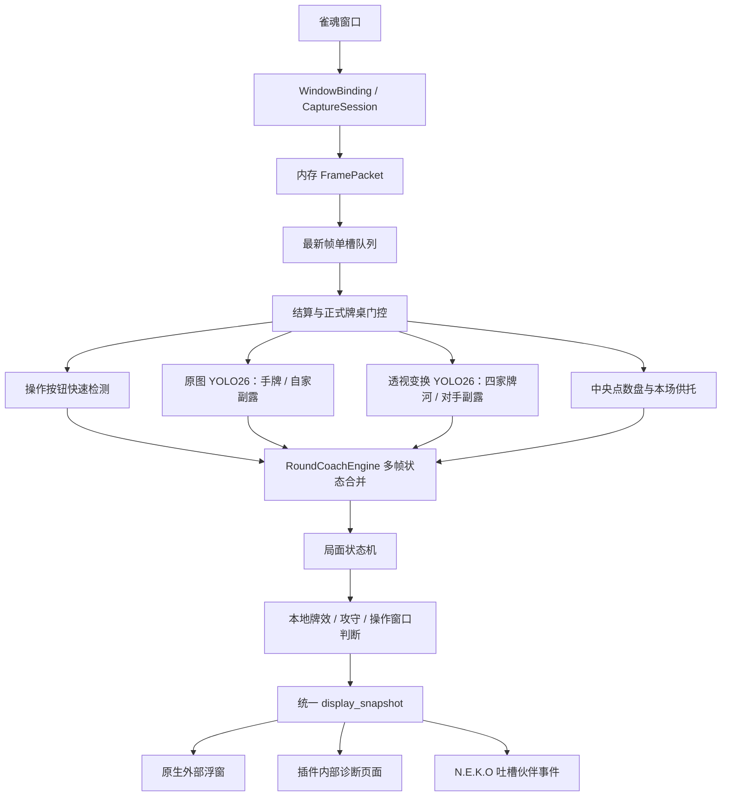
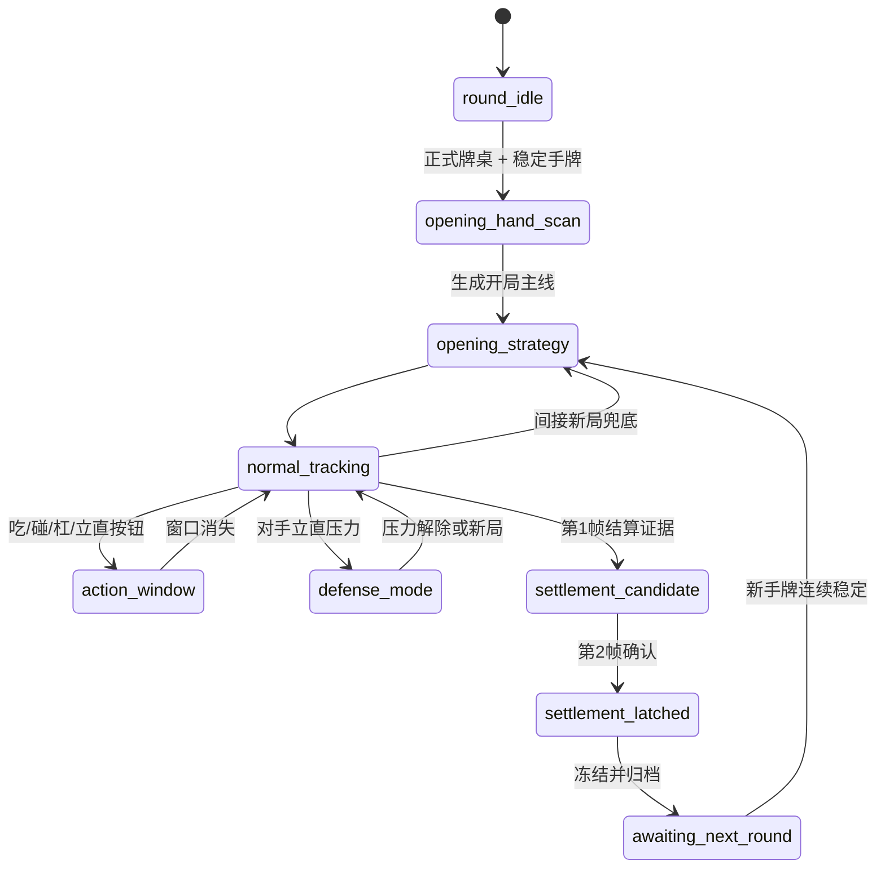
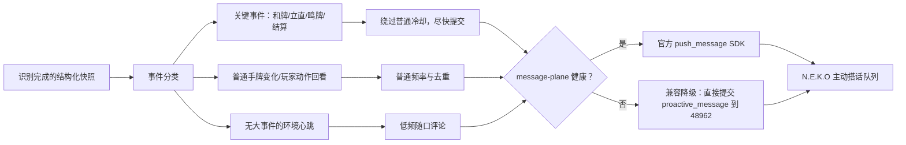
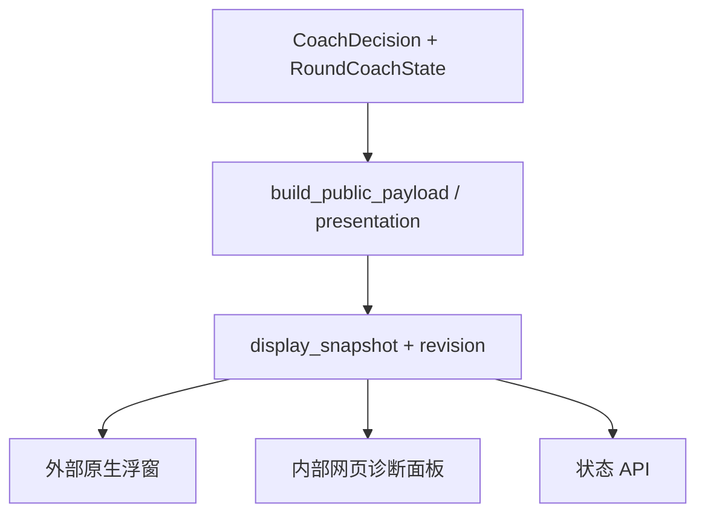
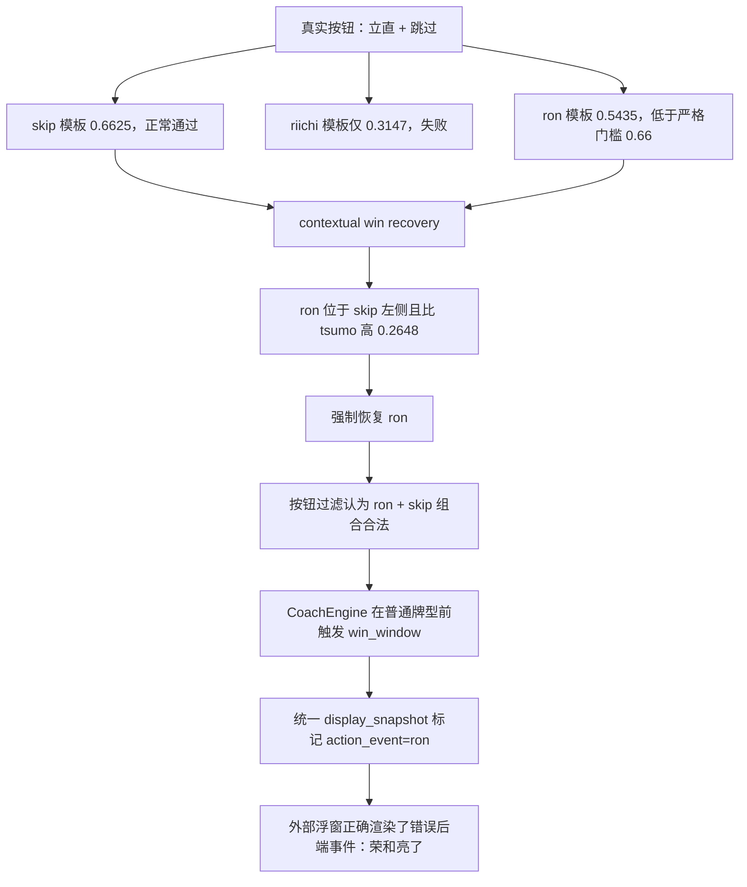

# Mahjong Coach 当前实现总状态与审查交接

> 状态快照时间：2026-08-11（Asia/Shanghai）
>
> 本文档是下一轮“从头审查雀魂插件”时的首要入口。它记录当前代码真实存在的能力、运行链、状态机、界面关系、验证基线、已知缺陷和未完成事项。
>
> 本文档描述的是当前脏工作树，不等于 `main`，也不等于已经提交或发布的稳定版本。设计稿、旧计划和未来 TODO 不得当成已完成功能。

## 1. 快照身份

| 项目 | 当前值 |
| --- | --- |
| 仓库 | `F:/NEKO_bugfix/A_NEKO_Base/N.E.K.O` |
| 当前工作树 | `F:/NEKO_bugfix/A_NEKO_Base/N.E.K.O/.codexworktree/mahjong-memory-slim-20260804` |
| 当前分支 | `codex/mahjong-memory-slim-20260804` |
| 当前 HEAD | `4d4c655079ac1e4e8448fd305edabebd69bec5aa` |
| 插件 ID | `mahjong_coach` |
| 插件版本 | `0.3.23.dev20260811`（已导出并校验） |
| Python | `>=3.11,<3.12`，项目命令必须通过 `uv run` 执行 |
| 当前插件测试 | `317 passed, 1 warning` |
| 已导出包 | `artifacts/mahjong-coach-distribution/mahjong_coach-0.3.23.dev20260811-windows-x64.neko-plugin` |
| 包大小 | `143,449,032` bytes，约 `136.80 MiB` |
| 包文件 SHA256 | `1d9a422682a081f92a1b72c56dc8c34031e8a62a5414f20c7746290fdd19d9a3` |
| 包 payload hash | `e3b543d4330539e296e786df39d6841b1642fbbc8d1c8ffd0754b2886b6e57a8`，已验证 |
| 工作树状态 | `60` 个未提交条目；当前导出包来自该脏工作树，而不是旧 HEAD |

### 1.1 最重要的交接警告

1. 当前功能横跨插件源码、N.E.K.O 插件安装器和构建器；不能只看 `plugin/plugins/mahjong_coach/` 就宣称全部修改已审完。
2. 当前包已经可构建、可校验，但源码尚未整理成一个干净提交；下一轮审查必须以当前工作树为事实基线，不能从旧 HEAD 猜实现。
3. 当前 `0.3.23.dev20260811` 源码测试版以及已导出的 `0.3.17.dev20260811` **仍包含本文第 14.1 节的“立直按钮误判为荣和”问题**。该问题已记录，但按用户要求暂不修复。
4. 目前没有完整麻将规则、役种、符数、振听和合法和牌引擎。所有本地建议都是可解释启发式策略，不应被描述为完整牌谱求解器。
5. 阶段三的外部玩家资料和役满 Monte Carlo 有代码，但用户已决定暂停继续开发与线上标定。

## 2. 产品定位与明确边界

### 2.1 当前产品定位

Mahjong Coach 是一个仅通过截图观察雀魂四麻牌桌的 N.E.K.O 插件。它不注入雀魂客户端、不读取进程内存、不自动点击按钮，也不上传原始截图给外部玩家资料服务。

当前有两个对话/展示方向：

- `companion`：吐槽伙伴。可以读取结构化牌局事件并与 N.E.K.O 本体的主动搭话链连接，但原则上不指导具体打牌。
- `strategy`：风险策略。明确输出当前主打牌，并列出 A/B/C 三张候选的风险、牌效和权衡；它不自动点击，也不会在识别不稳定时猜牌。

当前有两个策略力度：

- `simple`：简易策略、轻防守。普通危险只做轻量修正，整体中性偏积极，但仍保留多家立直、晚巡、极高危险和差牌型的硬防守边界。
- `standard`：完整攻守、全风险。完整使用允许线、危险度、牌效损失、场况和玩家画像。

当前有两个外部面板展示层级：

- `compact`：简洁主建议。策略模式把“主建议：打某牌”放在第一屏；吐槽伙伴仍只展示观察、方向和最近牌型。
- `strategy` / 完整卡片：扩大原生浮窗，展示姿态、风险允许线、三张方案卡、危险来源、牌型损失和比较理由。

策略力度与展示层级是两组独立设置。切换“简洁/详细”不应暗改策略算法；切换 `simple/standard` 才会改变内部攻守权重。

### 2.2 本轮明确不做或暂停

- 三麻。
- 自动读取雀魂进程内存、网络包或客户端内部对象。
- 自动点击荣和、自摸、立直、吃、碰、杠、跳过或弃牌。
- 猫娘 Live2D/资源占用的独立优化。
- UI 全面可爱化重做。
- 完整番种、符数、点数、振听和合法和牌精算。
- 阶段三线上接口持续验收、役满概率大样本标定和精算引擎。
- 完整对手行为模型、放铳模拟、四杠子、天和/地和、累计役满。

## 3. 总体运行架构



### 3.1 线程与异步边界

- N.E.K.O 插件入口可能在不同 asyncio event loop 上被调度。
- 实时捕获任务是长时间运行任务；手动状态查询、启动、停止、重载和分析入口可能来自另一个 host loop。
- 引擎互斥锁已改为 `_CrossLoopAsyncLock`：内部使用 `threading.Lock` 非阻塞轮询，避免 `asyncio.Lock` 在竞争后绑定单一 event loop。
- 视觉识别和策略计算通过线程执行，避免阻塞入口所在的 event loop。
- 捕获生产者与分析消费者之间使用单槽“最新帧优先”队列；新帧会替换尚未分析的旧帧，并累计 `dropped_frames`。
- 正常帧尽量以内存图像传递；磁盘路径主要保留给错误证据、最后预览或明确要求保存的诊断产物。

### 3.2 最近修复的跨 loop 故障

曾出现：实时循环停止，后端状态停留在上一局“两家立直、旧副露、旧牌型”，外部面板也显示同一份旧内容。

实际错误为：

```text
RuntimeError: asyncio Lock ... is bound to a different event loop
```

结论：当时不是前端独自落后，而是后端实时识别任务已经停止；前端忠实显示了后端旧快照。修复位置为 [`__init__.py`](../__init__.py) 中 `_CrossLoopAsyncLock` 和统一引擎锁获取路径。

## 4. 捕获、绑定与帧调度

### 4.1 窗口绑定

主要代码：

- [`window_binding.py`](../window_binding.py)
- [`capture.py`](../capture.py)
- [`__init__.py::_run_live_loop()`](../__init__.py)

当前行为：

- 使用窗口标题关键字寻找雀魂窗口，默认包括 `雀魂`、`Mahjong Soul`。
- 唯一匹配时可以直接绑定；多窗口候选可由 `mahjong_coach_window_candidates` 返回给界面选择。
- `WindowTargetDescriptor` 只持久化标题、应用名和匹配关键字，不跨进程保存 HWND。
- `CaptureSession` 缓存当前绑定与尺寸；窗口失效、尺寸变化、标题变化或捕获失败时重新定位。
- Windows 优先使用原生窗口捕获路径，并保留降级截图方案。
- 窗口暂时消失时应进入等待/重连，而不是把旧牌局直接当成结束。

### 4.2 内存帧与磁盘策略

- `FramePacket.image` 可以直接携带 PIL 图像。
- `FramePacket.image_path` 允许为空或使用逻辑 `memory://live-frame` 来源。
- `capture_memory_frame()` 正常不创建逐帧文件。
- `live.keep_frames=0` 时不保留常规历史帧。
- 结算诊断图、牌桌透视证据和最后预览由独立入口按需生成。
- 截图刷新使用 revision，避免固定 URL 被原生窗口或浏览器缓存后不重载。

### 4.3 调度与轮询

插件配置当前值：

| 配置 | 值 | 含义 |
| --- | --- | --- |
| `interval_ms` | `400` | 普通捕获间隔 |
| `fast_interval_ms` | `300` | 关键变化附近的快速间隔 |
| `checkpoint_interval_seconds` | `20` | 无明显事件时的时间检查点 |
| `river_tracking_mode` | `checkpoint` | 默认不在每一帧完整追踪牌河 |
| `keep_frames` | `0` | 不逐帧落盘保留 |

手牌、操作区和透视牌河分别生成快速指纹：

- 操作区或手牌变化：优先进入快速完整分析。
- 牌河变化或检查点到期：执行需要的牌河/策略复核。
- 三个区域都未变化：复用状态，不重复执行完整模型。
- 有新局两帧候选或立直待确认时：不能被静态指纹快路径跳过。

尚未完成：同机端到端 P50/P95 正式基线，特别是“画面变化到外部建议”的 P95 `<=750ms` 验收。

## 5. 感知模块

### 5.1 正式牌桌门控

主要代码：

- [`perception/game_scene.py`](../perception/game_scene.py)
- [`perception/table_surface.py`](../perception/table_surface.py)
- [`coach.py::_handle_game_scene_gate()`](../coach.py)

使用中央点数盘视觉签名和牌桌外层透视几何共同确认正式牌桌。大厅、房间创建页、设置菜单、退出遮罩和误绑其他窗口时，不应继续采信手牌、牌河、按钮和策略。

门控不是“一帧失败即清空”：短遮挡进入 `view_obstructed`，保留最后可靠状态；恢复后强制完整复扫。

### 5.2 YOLO26 可见牌识别

主要代码：[`perception/yolo26_visible_tiles.py`](../perception/yolo26_visible_tiles.py)。

当前默认 `tile_recognition_mode=yolo26`，但保留 `legacy` 显式选项和组件失败回退。

同一个轻量 ONNX 模型运行两个坐标空间：

1. 原始窗口图：识别底部自家手牌和自家副露。底部行不能先做牌桌透视，因为透视会拉伸或裁掉手牌。
2. `800x800` 透视牌桌：识别四家牌河、横置宣言牌和对手副露。

后处理职责：

- 将 34 种牌映射为 `1m-9m`、`1p-9p`、`1s-9s`、`1z-7z`。
- 按当前帧牌桌中心和四个方向扇区分配牌河归属。
- 只从对应桌边、连续几何和合法 3/4 张分组生成对手副露。
- 对碰/杠中唯一横置牌的类别误差做严格同牌修复，同时保留原始类别与修正理由。
- 通过玩家、位置和框 IoU 对齐历史牌河；不是简单按序号覆盖。
- 新弃牌、旧槽位改判和副露变化都有多帧稳定器。

当前部署候选是 HBB detect ONNX，不是 OBB；对旋转牌主要依赖几何后处理。OBB 解码与重新训练仍是 TODO。

### 5.3 自家副露稳定器

主要代码：[`coach.py::_stabilize_self_melds()`](../coach.py)。

设计原则：同一小局中，已经确认的副露数只能增加，不能因单帧漏检而消失。新增副露需要：

- 牌组完整；
- 和暗手张数一致；
- 空间上与暗手分离；
- 连续帧稳定，或刚发生的鸣牌窗口提供时序证据。

已修复的新局边界漏洞：旧局单调副露缓存曾先参与新局手牌一致性校验，使“新局 13 张门清 + 上局 1 副露缓存”被判成不可能的 16 张有效手牌，从而阻止换局。现在新局边界直接读取当前原始 YOLO 手牌/副露/牌河，连续确认后再清空旧缓存。

### 5.4 四家牌河与被鸣弃牌

主要代码：

- [`perception/discard_parser.py`](../perception/discard_parser.py)
- [`perception/river_state.py`](../perception/river_state.py)
- [`coach.py::_reconcile_full_river()`](../coach.py)
- [`coach.py::_link_claimed_discards()` 相关辅助逻辑](../coach.py)

当前行为：

- 普通新增弃牌默认连续两帧确认。
- 已存在槽位被识别成另一张牌，也需要连续确认后纠正。
- 吃碰杠短窗口允许更快接纳唯一新增弃牌，以避免操作建议过期。
- 被鸣走的弃牌仍保留在原玩家弃牌历史中，供对应玩家现物判断。
- 物理已见牌计数会过滤已被鸣走的历史实体，再从副露中只补一次，防止重复扣牌。
- 对手新副露只可在短同步窗口内关联刚从牌河消失的叫牌；旧副露不能吸收后续无关的单帧漏检。
- 吃牌来源限制为唯一合法上家。

尚未完成：独立的逐动作弃牌事件流、每张弃牌与明确玩家动作时序的全局绑定。

### 5.5 操作按钮识别

主要代码：[`perception/action_detector.py`](../perception/action_detector.py)。

识别类别：

```text
ron, tsumo, riichi, kan, pon, chi, skip
```

流程：

1. 对底部操作区做颜色/亮度预过滤；预过滤只能决定是否值得跑模板，不能单独产生按钮。
2. 在较大的底部搜索框内执行 RGB 与 HSV 融合模板相关匹配。
3. 使用每种按钮的独立阈值。
4. 对被角色特效遮挡的 `skip` 以及外观变化的 `ron/tsumo` 使用上下文恢复规则。
5. 对重叠框做 NMS，并用按钮组合规则过滤明显不可能的冲突。

关键行为：只要 `ron` 或 `tsumo` 被接纳，就会在手牌、牌河和普通策略前触发最高优先级 `win_window`。这保证真实和牌反应够快，也意味着按钮误报会直接污染吐槽与外部面板。当前已知误报见第 14.1 节。

### 5.6 对手立直识别

主要代码：

- [`perception/riichi_detector.py`](../perception/riichi_detector.py)
- YOLO26 透视牌河中的横置宣言牌证据
- [`coach.py::_detect_riichi_players()`](../coach.py)

设计：

- 左上角立直棒计数只表示桌面供托数量，不能独立证明当前是哪一家立直。
- 具体玩家立直依赖该玩家牌河中的横置牌、方向强度、普通牌数量和多帧确认。
- 已确认立直进入 `riichi_players`，每家分别计算风险，再合并多家压力。

当前状态仍是部分完成：实战中可能漏检或误检；不同皮肤、缩放和密集牌河需要更多样本。

### 5.7 四家点数、本场与供托

主要代码：[`perception/table_context.py`](../perception/table_context.py)。

当前可读取：

- 中央计分盘四家点数；
- 并列顺位；
- 左上角本场棒；
- 左上角供托/立直棒数量。

写入策略前要求连续两帧同签名，避免单帧 OCR 误读。稳定后用于：

- 领先保护或四位追分；
- 防守允许线修正；
- 本场每根 300 点、供托每根 1000 点的预期和牌收益。

尚未自动读取：局数、场风、自风、宝牌指示牌和南场/末局目标。

### 5.8 结算检测

主要代码：[`perception/settlement_detector.py`](../perception/settlement_detector.py)。

当前通过暗场、大型蓝色斜边结算面板、橙色长斜边和上方牌列等 OpenCV 几何证据识别和牌结算。连续两帧确认后：

- 冻结上一局手牌、副露、牌河、立直、策略和结算证据；
- 归档最近两局内存状态；
- 进入 `awaiting_next_round`；
- 等稳定新手牌后开始下一局。

已知边界：

- 只有一种真实和牌皮肤的正样本基线。
- 荒牌流局与途中流局尚无可靠分类器。
- 整场结束没有独立 `match_finished` 状态。
- 归档只在内存，插件重启后消失。

## 6. 小局状态机与重置



### 6.1 明确结算边界

```text
playing
  -> settlement_candidate
  -> settlement_latched
  -> archive + freeze previous round
  -> awaiting_next_round
  -> stable 12-14 tile new hand
  -> reset round-scoped caches
  -> opening_strategy
```

### 6.2 没拍到结算时的间接新局兜底

当前需要组合证据：

- 旧局牌河已经明显存在；
- 当前原始 YOLO 帧存在稳定 12–14 张自家牌；
- 当前牌河显著少于旧牌河：立即开局通常 `<=2`，中途恢复允许旧牌河至少 12 且当前不超过 12、当前数量不超过旧数量三分之一；
- 新手牌与旧手牌明显不同；
- 连续两帧与候选新手牌高度一致；
- 当前原始副露为 0，或可以证明是底部开局手牌被错误分到相邻副露区并可恢复为 12–14 张闭手。

确认后清理：

- 上局 `riichi_players` 和 `riichi_pending`；
- 自家/对手副露缓存；
- 四家牌河与纠错候选；
- 上局策略、危险姿态、最近牌型；
- 吐槽伙伴签名、节流和环境事件缓存；
- 外部 `display_snapshot`、预览图与结算证据 revision；
- 实时巡目、手牌变化和缺帧计数。

### 6.3 遮挡与新局的区别

- 菜单、动画、短暂手牌缺失：`view_obstructed`，保留状态。
- 结算锁存：冻结状态，不再让按钮或动画污染上一局。
- 旧牌河明显回退 + 稳定全新手牌：进入新局候选。
- 单帧手牌消失、尺寸变化或窗口丢失：不能直接重置。

## 7. 策略系统

### 7.1 本地路线

主要代码：[`coach.py`](../coach.py)。

当前可以评估：

- 普通面子手；
- 七对子；
- 国士方向；
- 染手倾向；
- 役牌加速；
- 断幺、平和等局部启发式；
- 已公开副露后的开放手方向；
- 多条役满路线的距离提示。

输出保留：最近牌型、当前向听、有效牌种数、估计有效枚数、保留结构、局面方向和不确定性。

### 7.2 牌效

牌效综合：

- 标准形向听；
- 七对子向听；
- 国士向听；
- 每个候选弃牌后的向听；
- 有效牌种类与扣除可见牌后的估计剩余枚数；
- 对子、相邻搭子、嵌张、边张和孤张结构；
- 宝牌及宝牌周边；
- 当前路线与副露数。

标准向听缓存上限已从 4096 缩到 1024，并可在空闲/停止时清理，减少长期内存增长。

### 7.3 玩家画像

`PlayerProfile` 当前字段：

| 维度 | 可选值 |
| --- | --- |
| 段位 | `unknown/novice/adept/expert/master/saint/celestial` |
| 房间 | `unknown/bronze/silver/gold/jade/throne/friendly` |
| 风险偏好 | `conservative/balanced/aggressive` |
| 目标偏好 | `speed/balanced/value/yakuman` |
| 副露偏好 | `closed/balanced/open` |
| 来源 | `manual/amae_koromo` |

旧配置迁移：

- `riichi`：均衡风险、均衡目标、门清偏好。
- `fast`：激进风险、速度目标、积极副露。

已知暂定 TODO：外部面板本次显式打法选择可能被玩家画像推导覆盖；之后应记录“用户本会话显式选择”，并使其优先于画像推断。目前只登记，不在本次改动中处理。

### 7.4 三态攻守

`DefensePosture`：

- `push`：牌型收益足以覆盖风险，继续推进。
- `mawashi`：兜牌；在安全预算内尽量维持向听和有效牌。
- `fold`：攻击收益不足或多家压力过高，安全优先。

候选综合：

- 向听与有效牌；
- 预估打点；
- 宝牌和宝牌邻接；
- 巡目；
- 单家/多家立直；
- 现物、筋、壁、全见牌；
- 对手公开副露；
- 当前点数、顺位、本场、供托；
- 玩家风险偏好、目标和房间。

姿态有跨帧稳定区间，避免相邻截图在推进、兜牌和全退之间频繁跳变。

### 7.5 危险度与允许线

- 每张牌危险度是 `0–100` 的规则型相对指数，不是实际放铳概率。
- 界面展示基础分、宝牌/多家立直/巡目等修正和逐项算式。
- 本局风险允许线与单牌危险度分开计算。
- `simple` 模式放宽普通危险权重，但不通过伪造一个固定“至少 7% 放铳率”来调参。
- `standard` 模式完整比较危险和牌效损失。
- 详细卡片明确方案 A 为当前综合主建议，方案 B/C 为对照；每张牌同时解释风险依据、向听、有效牌和牌型损失。

### 7.6 操作窗口策略

当前按钮优先级：

1. `ron/tsumo`：最高优先级事件，立即生成 `win_window`。
2. `chi/pon/kan/riichi`：进入 `action_window`，使用当前手牌、副露和必要的牌河增量。
3. 普通牌型检查点、防守和环境吐槽。

本地可以计算鸣牌后的牌效分支和立直等待牌，但产品展示层应避免直接输出自动操作命令。

## 8. 吐槽伙伴与 N.E.K.O 本体连接

主要代码：

- [`presentation.py::build_neko_companion_cue()`](../presentation.py)
- [`__init__.py::_push_neko_companion_if_needed()`](../__init__.py)
- [`__init__.py::_select_neko_companion_ambient_event()`](../__init__.py)



当前特性：

- 插件可以主动向 N.E.K.O 提交结构化只读事件，不要求额外打开“猫娘窥屏”；插件本身已经提供牌局观察事实。
- N.E.K.O 主动搭话能力仍必须在本体侧可用；插件不会直接绕开本体的消息/语音渲染链。
- 正常链路仍使用官方 `push_message` SDK；若旧宿主在热重载后只丢失 `38865–38867` 消息平面、但主对话事件端口 `48962` 仍健康，则插件按宿主既有 `proactive_message` 协议直接提交。此兼容降级只绕过失效的中间桥，不自行生成回复或语音。
- 关键事件可绕过普通冷却；环境观察和空闲心跳只在已确认存在立直压力时启用，并有独立频率与签名去重。未检测到立直不会因为“牌桌很安静”单独触发搭话。
- 对手新副露是独立高优先级事件，不依赖立直或环境心跳。确认后会把“哪一家吃/碰/杠了什么”和该玩家当前全部公开副露送给对话层；同一副露跨帧去重，短暂漏检后恢复不会重复播报，提交失败时会保留待重试事件。
- 吐槽提示明确要求不编造未发生的立直、鸣牌、和牌或逆转。
- 传给对话层的是压缩后的结构化证据；不会把整副手牌逐张念一遍。
- “牌河证据不足”“尚无稳定置信度”等内部诊断只保留在详细分析数据中，不再送入吐槽伙伴提示，也不再让角色评价数据完整度或自己是否敢判断。
- 普通局面约 12 秒没有关键事件时，插件可以低优先级触发一次自然闲聊；闲聊提示不携带牌局证据，不要求硬谈麻将，并要求避开上一条回复的核心句式。关键事件始终优先，闲聊仍受每局次数上限与时间节奏控制。
- 自摸与荣和各有 6 组即时反应，依据当前局次、状态更新序号和手牌签名稳定选择；同一和牌窗口反复识别时内容不抖动且被事件签名去重，不同局次会自然轮换。对话提示额外禁止固定复读“总算没白等/可算等到了”。
- 新增默认关闭的“逆天模式”：仅在吐槽伙伴开启时有效。普通时刻从扩展后的日常话术池轮换，一条回复只用一个梗；立直和对手吃碰杠会先准确播报已确认事件，再接各自的专用短梗；和牌继续走正常即时庆祝。
- 吐槽伙伴不再根据自身手牌强弱、成型路线或牌效评价“牌运、手气、顺不顺、僵不僵”，玩家普通操作后也不评价打得对不对。删除原因不是产品上禁止讨论好运，而是实测生成层会把好牌和烂牌都套成“牌运很好”，评价无法可靠跟随结构化牌质。客观牌型分析仍完整保留在策略与详细分析面板中。
- 逆天模式的普通梗、立直梗和对手吃碰杠梗现在使用插件生成的最终短句并通过 `direct_reply` 直接送达 N.E.K.O，不再交给生成模型二次扩写。原因是仅靠否定提示仍会被模型连续补写“牌运很好”等牌质评价。和牌窗口继续保留角色的自然庆祝反应。
- 独特彩蛋有独立低频限制；不同梗不混合在同一句中。

风险：吐槽层只能相信感知层提供的事件。本次 `ron` 误报进入后，吐槽层按设计立即生成“荣和亮了”；因此问题来源是按钮感知，不是 N.E.K.O 文案生成器。

## 9. 内部页面、外部浮窗与同步关系

### 9.1 唯一快照原则

识别事务完成后，插件将 `last_decision + round_state` 转换为统一 `display_snapshot`，并带 revision 发布。



外部与内部不应各自重新算策略；两者只负责渲染同一快照。最近实测中，后端和 `display_snapshot` 的手牌数、副露数、立直玩家与阶段一致。

### 9.2 外部浮窗

主要代码：[`overlay.py`](../overlay.py)。

当前能力：

- 首次打开进入模式/打法选择，而不是直接塞入策略正文。
- 可以启动/停止实时捕获。
- 提供独立的“推荐打牌”开关：关闭时为吐槽伙伴，只聊局势；开启时为风险策略，必须显示主建议和 A/B/C 的具体牌。
- 可以选择简易策略或完整攻守。
- 可以选择简洁主建议或完整策略卡片。
- 详细模式扩大窗口并显示三张方案卡。
- 风险策略的简洁窗第一条显示具体主打牌；详细卡片显示 A/B/C 的具体牌名和推理过程。
- 吐槽伙伴继续裁掉候选牌、排序和操作建议，不会因为策略模式变得可操作而泄露指导内容。
- 和牌窗口、结算、等待下一局和空闲状态会强制清空策略候选，避免上一局的主建议残留。
- 关闭按钮使用独立命中区域；点击后先立即隐藏并退出本地浮窗，再通知宿主停止实战循环，即使宿主回调缺失或失败也能关闭；旧的 `?` 详情按钮已经不再作为主要入口。

### 9.3 展示契约（2026-08-10 更新）

`presentation.py` 现在按模式生成不同但来源一致的公共数据：

| 字段/行为 | 吐槽伙伴 | 风险策略 |
| --- | --- | --- |
| `primary_action` | 空 | `主建议：打4万` 等具体主建议 |
| `risk_options` | 空 | A/B/C，包含规范牌码、中文牌名、风险和牌型解释 |
| `last_decision.suggestion` | 空 | 与 `primary_action` 相同 |
| `round_state.current_plan/local_plan` | 空 | 与 `primary_action` 相同 |
| N.E.K.O cue | 只读观察，不含候选 | 不生成吐槽 cue |
| 结算/和牌边界 | 不携带操作建议 | 强制清空候选，防止旧建议残留 |

内部页面、外部简洁窗和外部完整卡片都必须消费同一个 `display_snapshot.revision`，不得从原始 `CoachDecision` 各自重新推导牌名或排序。

### 9.4 内部诊断页面的三类图

1. 变换后牌桌识别证据图：主视图，应放大，用于观察牌河归属、对手副露和 YOLO 框。
2. 原始捕获截图：用于确认窗口绑定与原图手牌/自家副露。
3. 结算判定证据图：专门显示结算几何，缩小放置；它不应带手牌/牌河分区，更不能拿原始图冒充。

预览入口：

- `mahjong_coach_frame_preview`
- `mahjong_coach_table_region_preview`
- `mahjong_coach_settlement_preview`

## 10. 推理运行时、GPU 与内存

### 10.1 两种推理模式

| 模式 | 内部值 | 当前行为 |
| --- | --- | --- |
| 低内存 | `memory` | CPU 优先；关闭内存 pattern 和 CPU arena，顺序执行，线程数受限 |
| 极速 | `speed` | 尝试 `CUDAExecutionProvider`、`DmlExecutionProvider`，失败后回退 CPU |

当前导出的 `windows-x64` 插件包带 Windows x64 原生依赖，因此文件名明确标注架构。它不是 NEKO 整个桌面安装包，只是雀魂插件包。

正式 Windows 桌面构建默认目标是 DirectML，可兼容 AMD、Intel 和 NVIDIA；CUDA 是可选构建组件，需要 ABI 对齐的 `onnxruntime-gpu`、CUDA 12.x 和 cuDNN 9。运行时面板必须显示实际 provider，不能把用户选择“极速”直接冒充成 CUDA 已生效。

### 10.2 预热

- `mahjong_coach_warmup_yolo26` 可以提前建立并跑一次极速 provider session。
- 相同 provider 的预热任务和 session 会复用。
- 开始实时识别时，如果选择 `speed`，会等待/复用已有预热，减少第一次关键事件分析的冷启动。
- `memory` 模式不做 GPU 预热。

### 10.3 已做内存收缩

- 正常帧内存传递，减少逐帧文件和重复图像副本。
- 单槽队列防止积压旧帧。
- 透视图、YOLO 结果和诊断图只保留必要缓存。
- 停止实时识别时释放模型外的瞬态资源。
- 标准向听 LRU 上限 1024，并支持清理。
- ONNX Runtime 低内存选项关闭 arena/memory pattern，并限制 CPU 线程。
- 状态接口提供 RSS、peak RSS、private memory、缓存条目、队列长度和任务状态。

尚未完成：长时间实战的内存曲线、Windows 私有工作集峰值和 DirectML/CUDA 显存的可靠归属统计。

## 11. 插件入口清单

| 入口 | 用途 |
| --- | --- |
| `mahjong_coach_status` | 读取配置、实时状态、统一显示快照、运行时与资源统计 |
| `mahjong_coach_warmup_yolo26` | 预热极速推理 provider |
| `mahjong_coach_save_preferences` | 保存自动开始和窗口描述符 |
| `mahjong_coach_save_profile` | 保存手动玩家画像 |
| `mahjong_coach_search_player` | 主动按昵称搜索 Amae-Koromo 四麻账号 |
| `mahjong_coach_preview_player_profile` | 获取外部统计建议但不生效 |
| `mahjong_coach_confirm_player_profile` | 用户确认后应用外部画像 |
| `mahjong_coach_frame_preview` | 返回最新原始捕获预览 |
| `mahjong_coach_table_region_preview` | 返回透视牌桌与分区证据图 |
| `mahjong_coach_settlement_preview` | 返回结算诊断图 |
| `mahjong_coach_reset_round` | 手动重置当前小局状态 |
| `mahjong_coach_analyze_frame` | 分析单张截图并更新统一快照 |
| `mahjong_coach_start_live` | 启动窗口捕获、分析和外部浮窗 |
| `mahjong_coach_stop_live` | 停止实时捕获并释放瞬态资源 |
| `mahjong_coach_show_overlay` | 重新显示外部浮窗 |
| `mahjong_coach_window_candidates` | 列出可绑定窗口 |
| `mahjong_coach_extract_hand_crops` | 导出训练用手牌裁剪 |

## 12. 数据模型

主要代码：[`models.py`](../models.py)。

### 12.1 `RoundCoachState`

按职责分组：

- 小局身份：`round_id`、`round_phase`、`update_count`、`last_update_reason`。
- 策略：`play_style`、`strategy_preset`、`opening_plan`、`current_plan`、`plan_source`。
- 最近牌型：`closest_shape_route`、`current_shanten`、`current_effective_count/types`。
- 攻守：`attack_defense_bias`、`defense_posture`、`defense_risk_budget`。
- 手牌：签名、牌列表、置信度。
- 自家副露：牌组、牌面、组数、置信度。
- 对手副露：按玩家分组的公开组与公开牌面。
- 牌河：四家历史、当前可见牌、置信度和初始化状态。
- 立直：确认玩家、待确认计数、桌面供托基线。
- 场况：四家点数、顺位、本场、供托、置信度和两帧候选。
- 结算：phase、kind、confidence、evidence、确认帧数。
- 吐槽：最近玩家弃牌、反应文本和反应类型。

### 12.2 `CoachDecision`

包含：

- `decision_type`
- `priority`
- `action_required`
- `summary/detail/suggestion`
- `buttons`
- `hand_tiles`
- `reason_codes`
- `coach_state`
- `perception`
- `engine_meta`
- `analysis_source`
- `quiet`

内部决策仍可能拥有详细候选和牌面；公共展示层会按 `companion/strategy` 模式裁剪，避免把内部操作排序直接暴露为代打指令。

### 12.3 `LiveSessionState`

记录实时任务是否运行、当前状态、帧编号、时间、错误、最后帧 revision、窗口标题、捕获来源、绑定、手牌变化、缺帧数、丢弃帧数和浮窗开关。

## 13. 阶段状态矩阵

| 模块 | 状态 | 已具备 | 主要缺口 |
| --- | --- | --- | --- |
| 直接窗口捕获 | 部分完成 | 长期绑定、内存帧、自动重连 | 多窗口/尺寸变化长期实战验收 |
| 最新帧队列 | 已实现 | 单槽、丢弃旧帧 | 端到端延迟标定 |
| 指纹调度 | 已实现 | 手牌/按钮/牌河分级 | 多主题误触发统计 |
| YOLO26 手牌 | 可用 | 默认 ONNX、34 牌类、原图空间 | 全分辨率/遮挡/主题回归 |
| 自家副露 | 可用 | 张数、空间、时序稳定器 | 更多真实错分样本 |
| 四家牌河 | 可用但需标定 | 透视分区、多帧纠错 | 独立逐动作事件流 |
| 对手副露 | 可用但需标定 | 归属、吃碰杠、叫牌关联 | 密集外圈与动画长期测试 |
| 操作按钮 | 存在高优先级误报 | RGB/HSV 模板、上下文恢复 | 第 14.1 节荣和误报 |
| 对手立直 | 部分完成 | 横置牌、玩家归属 | 漏检/误检与不同缩放 |
| 点数/顺位/本场/供托 | 已实现 | 两帧确认并进入策略 | 局数、场风、自风、宝牌 |
| 和牌结算 | 部分完成 | win、两帧锁存、归档 | 流局、整场结束、多皮肤 |
| 新局重置 | 自动测试完成 | 明确结算 + 间接兜底 | 连续真实整场回放 |
| 本地牌效 | 已实现 | 向听、有效牌、路线 | 完整规则/役种/振听 |
| 三态攻守 | 已实现 | push/mawashi/fold | 固定真实牌谱矩阵 |
| 玩家画像 | 已实现 | 手动画像、旧配置迁移 | 显式打法与画像优先级 |
| 外部画像 | 暂停 | provider、缓存、确认链 | 真实线上稳定性验收 |
| 役满路线 | 暂停 | 即时距离、后台 MC | 大样本标定和精算 |
| 外部/内部同步 | 已实现并修正展示契约 | 统一 display_snapshot；策略主建议和 A/B/C 牌名贯通 | 继续做长时间 revision 回归 |
| 吐槽伙伴 | 已接通并有旧宿主降级 | 关键/普通/环境事件；message-plane 失败时直达 48962 | 感知误报会直接污染吐槽；其他插件仍依赖宿主修复 |
| 内存优化 | 已做主体 | 内存帧、缓存收缩、资源统计 | 长时间曲线和 GPU 归属 |
| 极速模式 | 已实现选择与预热 | CUDA/DML/CPU provider 状态 | 分发机型矩阵 |
| 分发包 | 已导出并校验 | 0.3.23.dev20260811 Windows x64 | 源码未提交；安装恢复仍依赖匹配的 host |

## 14. 已知事件与缺陷

### 14.1 `INC-20260810-ACTION-RON-FALSE-POSITIVE`：立直窗口被识别成荣和

状态：**已复现、已定位、按用户要求暂不修复。**

影响版本：至少包含 `0.3.15.dev20260810`、`0.3.16.dev20260811`、`0.3.17.dev20260811` 导出包与当前 `0.3.23.dev20260811` 源码测试版。

原始证据：

- 牌桌截图：`C:/Users/19079/AppData/Local/Temp/codex-clipboard-39da7c68-57ce-4186-8f96-07ccbd39768b.png`
- 截图 SHA256：`92d40fb2dd9c4936cadd2489a117cc4cd2271222af20728a71c78b1c46306e8f`
- 外部浮窗截图：`C:/Users/19079/AppData/Local/Temp/codex-clipboard-1c613c89-2653-489a-9c4e-9ee3c54df76c.png`
- 浮窗截图 SHA256：`01c98415ee6184f60c7f792ecdca1396105281144a85f58d8057d947ed881f89`

画面事实：

- 东二局，余 16。
- 自家底部为 14 张牌，画面无自家副露。
- 实际可见操作按钮是橙色“立直”和灰色“跳过”。
- 外部浮窗却显示：“荣和亮了——这一下可算等到了”“和牌窗口已经出现”。

同一原图 YOLO26 离线结果：

```text
hand_count = 14
hand = 9m, 5p, 5p, 5p, 4s, 5s, 6s, 1z, 2z, 2z, 2z, 4z, 4z, 4z
self_meld_count = 0
river_count = self 13 / right 13 / top 14 / left 13
yolo26_riichi_players = [right_opponent]
confidence = 0.9367
```

按钮检测复现结果：

```text
returned buttons = [ron, skip]

skip:
  score = 0.6625
  threshold = 0.58
  accepted = true

ron:
  strict score = 0.5435
  strict threshold = 0.66
  strict result = below threshold
  contextual recovery = accepted
  recovery reason = confirmed_skip_and_distinct_win_slot
  win-label margin over tsumo = 0.2648

riichi:
  score = 0.3147
  threshold = 0.62
  accepted = false

tsumo:
  score = 0.2787
  threshold = 0.66
  accepted = false
```

完整错误链：



根因判定：

- 这是**后端操作按钮感知误报**。
- 不是外部面板落后于后端。
- 不是上一局缓存未重置。
- 不是吐槽文案自行编造；文案层忠实响应了后端 `ron`。
- 具体风险点是 `_recover_contextual_win()`：它允许一个低于严格模板阈值的和牌候选，只凭“右侧有已确认 skip、位置相邻、比另一个和牌标签高”恢复；此规则没有证明真实按钮是和牌，也没有识别出同位置更真实的立直按钮。

为什么影响明显：

- `ron/tsumo` 是最高优先级中断，不经过普通指纹、手牌和策略检查点。
- 吐槽伙伴对关键和牌事件会突破普通频率限制，所以误报会立刻出现在外部浮窗和 N.E.K.O 对话中。
- 用户会误以为插件连最明显的“立直”都没看到，且错误事件覆盖了正常牌型分析。

本次明确未做：

- 未改阈值。
- 未删除上下文和牌恢复。
- 未增加两帧确认。
- 未补立直模板。
- 未改变关键事件优先级。
- 未重新导出一个修复包。

后续审查时需要回答，但当前不执行：

1. 立直按钮模板为何在该皮肤/分辨率只有 0.3147。
2. `ron` 恢复是否必须加入更强的字形/颜色/按钮槽证据。
3. `ron/tsumo/riichi` 是否应在同一物理槽内做联合分类，而不是独立模板后再恢复。
4. 能否在不牺牲真实和牌即时性的前提下加入一帧快速复核或手牌合法性旁证。
5. 需要建立哪些真实 action-window 正负样本，防止只针对这一张图调参。

### 14.2 安装中断后的残留目录

历史症状：卸载/升级时 Windows 锁住 `cv2.pyd` 等原生文件，旧主机可能先删掉 `plugin.toml` 等文件，再在 `rmtree` 中途失败，留下无身份的 `mahjong_coach` 目录。下一次导入报：

```text
target already exists: ...\neko-package-profiles\mahjong_coach
plugin package cannot be installed safely
```

当前工作树包含 N.E.K.O host 侧恢复逻辑：

- 删除时先把插件目录原子重命名到 `.delete-pending`，再尽力清理，立即释放规范安装路径。
- 发现无有效 `plugin.toml` 的孤儿目标时移动到 `.install-recovery`，安装失败则尽力回滚。
- 重装程序时保留已存在的用户 profile，不因同名 profile 直接失败，也不在失败回滚时误删旧 profile。
- 插件包默认不再携带 default profile，减少覆盖用户设置的风险。

重要边界：这是 N.E.K.O 本体安装器的修改，不是 `.neko-plugin` 包内部逻辑。使用旧版 N.E.K.O host 的其他电脑不会因为只拿到新插件包就自动获得全部恢复能力。

### 14.3 其他明确缺口

- 荒牌/途中流局分类缺样本。
- 整场结束缺独立状态。
- 局数、场风、自风、宝牌未自动读取。
- 立直与按钮识别仍需更大真实样本集。
- 没有完整规则与合法和牌引擎。
- 没有开发网页、Electron 分发、无网页原生启动三种模式的固定录屏矩阵。
- 没有端到端 750ms P95 正式验收。
- 当前源代码改动规模大且未提交，存在重复逻辑、不可达分支和状态所有权不清的审查风险。

## 15. 已验证基线

### 15.1 自动测试

最新命令：

```powershell
uv run pytest plugin/plugins/mahjong_coach/tests -q
```

结果：

```text
298 passed, 1 warning
```

唯一警告是 `plugin.core.state` 对旧配置根常量的弃用警告，不是雀魂测试失败。

覆盖类别包括：

- 窗口捕获、内存帧与最新帧队列；
- 跨 event loop 引擎互斥；
- 模型 session 缓存、低内存 ONNX 选项和 GPU 预热复用；
- 旧配置迁移与玩家画像；
- 三态攻守、风险预算、候选证据与简易/完整策略；
- 外部浮窗偏好、策略卡和静态 UI 调用；
- 点数/顺位/本场/供托；
- 手牌、自家副露、牌河、对手副露和立直；
- 结算锁存、归档、新局确认与实时缓存清理；
- 阶段三 mock provider 与固定随机种子役满估算；
- 分发 provider 选择和 Windows runtime 组件检查。

### 15.2 最近现场验证

针对上一轮“新局仍显示两家立直和旧副露”：

- 修复前：engine state、display snapshot、overlay 三者一致停在旧局；live task 已停止并报告跨 loop 锁错误。
- 修复后：实时任务 `running=true/status=observing/error=''`。
- 用户给出的新局截图手动分析为 13 张、0 副露、0 立直。
- 随后的真实捕获中，后端与 display snapshot 同时显示 14 张、0 副露、无立直、`normal_tracking`。
- 新增测试覆盖“旧局 1 副露 + 两家立直 → 新局 13 张门清”和旧牌河大幅回退的中途恢复。

### 15.3 包校验

```text
metadata_found = true
payload_hash_verified = true
payload_hash = e3b543d4330539e296e786df39d6841b1642fbbc8d1c8ffd0754b2886b6e57a8
```

`neko-plugin check mahjong_coach` 为 0 error、7 warning。警告来自该内置插件目录不是独立插件仓库，缺少独立 README、smoke test、VS Code 设置、独立 workflow 和独立 `.gitignore`；这些不阻止当前内置插件包构建，但如果以后拆成独立仓库，需要补齐。

## 16. 当前代码规模与审查风险

当前几个核心单体文件非常大：

| 文件 | 约大小 | 主要职责 | 审查风险 |
| --- | ---: | --- | --- |
| `coach.py` | 246 KB | 状态机、感知合并、策略、牌效、防守、鸣牌 | 职责过多、状态先后顺序容易互相阻断 |
| `overlay.py` | 161 KB | Win32/Tk 外部窗、设置页、绘制、文本卡 | 两套原生后备路径可能出现布局/行为重复 |
| `__init__.py` | 149 KB | 插件入口、实时任务、预热、快照、N.E.K.O 同步 | 生命周期、线程、事件循环和展示协调耦合 |
| `yolo26_visible_tiles.py` | 78 KB | ONNX、双空间检测、分区、分组、诊断 | 模型运行与复杂后处理耦合 |
| `presentation.py` | 42 KB | 公共裁剪、吐槽、风险与证据文本 | 内部决策到公共展示的字段裁剪可能重复 |

相对当前 HEAD 的相关改动约为：

```text
44 files changed
6154 insertions
664 deletions
```

下一轮审查应优先寻找：

- 多处分别持有“当前状态”的情况；
- 生成建议和渲染建议重复计算；
- 已实现但入口永远不可达的功能；
- 旧 legacy 与 YOLO 路径不对偶；
- compact/detail、companion/strategy、simple/standard 组合中的遗漏分支；
- 跨帧候选未在新局、停止、重载时清理；
- 同一图片在原图、透视图、结算图之间错误复用；
- 同一模型 session 被不同 provider/线程重复加载；
- overlay 的 Win32 和 Tk 后备路径控件命中区不一致；
- 插件内状态与 N.E.K.O host 安装/profile 状态混在同一修改批次。

## 17. 下一轮“从头审查”建议顺序

这只是审查顺序，不代表本次开始修复：

1. 冻结当前工作树身份、导出 `git diff` 和文件清单，确认哪些改动属于雀魂，哪些属于 host/打包器。
2. 从 `plugin.toml` 与所有 `plugin_entry` 建立入口到函数的可达图。
3. 审查 live 生命周期：start、capture、queue、analyze、stop、reload、window lost、auto reconnect。
4. 审查每个跨帧缓存的创建、更新和清理所有权。
5. 审查感知优先级：结算门控、牌桌门控、按钮中断、指纹跳过、手牌/副露、牌河和新局确认。
6. 用本次 `ron` 误报作为第一条真实 action-window 回归，但不要只对单图调阈值。
7. 审查 `CoachDecision -> presentation -> display_snapshot -> overlay/internal UI -> N.E.K.O cue`，确保只生成一次事实与策略。
8. 审查策略模式组合矩阵，确认不存在实现了但 UI/入口永远传不到的分支。
9. 审查内存所有权：PIL 图像、透视图、ONNX session、诊断 JPEG、LRU、历史局和队列。
10. 最后再做结构拆分建议；在完成行为测试前不删除旧代码。

## 18. 关键源码索引

| 范围 | 文件 |
| --- | --- |
| 插件生命周期、入口、实时循环 | [`__init__.py`](../__init__.py) |
| 局面状态机、策略、牌效、防守 | [`coach.py`](../coach.py) |
| 数据模型 | [`models.py`](../models.py) |
| 捕获 | [`capture.py`](../capture.py) |
| 窗口绑定 | [`window_binding.py`](../window_binding.py) |
| 原生外部浮窗 | [`overlay.py`](../overlay.py) |
| 公共展示与 N.E.K.O cue | [`presentation.py`](../presentation.py) |
| 玩家画像/provider | [`player_profile.py`](../player_profile.py) |
| 役满距离与 Monte Carlo | [`yakuman.py`](../yakuman.py) |
| 操作按钮 | [`perception/action_detector.py`](../perception/action_detector.py) |
| YOLO26 | [`perception/yolo26_visible_tiles.py`](../perception/yolo26_visible_tiles.py) |
| 牌桌透视 | [`perception/table_surface.py`](../perception/table_surface.py) |
| 正式牌桌门控 | [`perception/game_scene.py`](../perception/game_scene.py) |
| 点数与计数器 | [`perception/table_context.py`](../perception/table_context.py) |
| 结算 | [`perception/settlement_detector.py`](../perception/settlement_detector.py) |
| 内部页面 | [`static/index.html`](../static/index.html)、[`static/main.js`](../static/main.js)、[`static/style.css`](../static/style.css) |
| 插件配置 | [`plugin.toml`](../plugin.toml)、[`pyproject.toml`](../pyproject.toml) |
| 自动测试 | [`tests/`](../tests/) |

## 19. 旧文档的定位

| 文档 | 现在的用途 |
| --- | --- |
| [`strategy_layer_progress_plan.md`](./strategy_layer_progress_plan.md) | 历史策略计划、阶段状态与变更记录；部分基线日期较旧 |
| [`yolo26_recognition_execution.md`](./yolo26_recognition_execution.md) | YOLO26 双坐标空间、运行时与数据流设计说明 |
| [`yolo26_recognition_todo.md`](./yolo26_recognition_todo.md) | YOLO 模型、数据集、OBB 与验收 TODO |
| [`llm_strategy_advisor_plan.md`](./llm_strategy_advisor_plan.md) | 可选 LLM 顾问目标设计；不代表已实现 |
| [`hand_classifier_upgrade_checklist.md`](./hand_classifier_upgrade_checklist.md) | 旧手牌分类器升级清单 |
| [`yakuman_exact_probability_todo.md`](./yakuman_exact_probability_todo.md) | 役满精算引擎的后续范围 |
| [`CUDA_COMPONENT.md`](../CUDA_COMPONENT.md) | Windows DirectML/CUDA 分发说明 |

如果本文与旧文档在“当前是否已实现”上冲突，以本文和当前代码/测试为准；如果是历史设计缘由，再查对应旧文档。

## 20. 本次文档记录结论

- 已记录并精确复现“立直 + 跳过被识别为荣和 + 跳过”的事件。
- 已确认错误源在后端操作按钮感知的 contextual win recovery，不是外部面板不同步。
- 按用户要求，本次不修改识别逻辑，不重新导出修复版。
- 已把当前雀魂插件的产品边界、运行架构、状态机、感知、策略、N.E.K.O 对话、内外面板、性能、分发、已知问题、验证基线和下一轮审查顺序集中到本文。
- 下一轮可以直接从本文第 16、17 节开始全量审查，不需要依赖本次超长对话恢复上下文。
